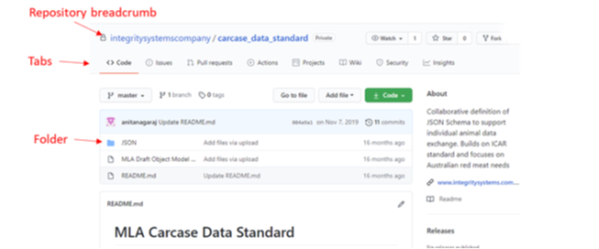

# Using GitHub
This document describes simple use of GitHub for viewing and commenting on a document.

The Integrity Systems Company repository Common Carcase Schema is a public repository.  So you are able to view the content without signing up or logging in to GitHub.  However, if you wish to comment on any of the documents you will need to sign-up and login to GitHub.

## Sign Into GitHub & Navigate
Link to ISC Carcase Data Standard GitHub repository 
https://github.com/Integrity-Systems-Company/common_carcase_schema 

Sign in using your username or email address.

This will take you into your GitHub repository.

There is a row of tabs across the top.

The **Code** tab shows the files and documents that have been stored in the repository.  It may be structured into folders.  Click a file to view it or click a folder name to open the folder.  You can go back up to a higher level by clicking an element in the breadcrumb which is located above the tabs.

If the document you want to view is an Excel workbook, click the filename, then in the resulting dialogue either click **View raw** or **Download**.  This will download a copy of the file to your computer and you can open it from there.

## Commenting on a document

If you wish to comment on a document, go to the **Issues** tab.

Before you raise a new issue , check that the same issue has not already been raised in the list of issues.

## Create a New Issue

Click the **New Issue** button to raise a new issue.  It is very straightforward – provide a title, enter your comments then click **Submit new issue**.

## Existing Issues

Click an existing issue’s title to view it. 

Under the list of comments on an issue is the Comment form.

You can comment on the issue and on previous comments in the comment form:

This approach ensures that all the comments on the same issue are arranged together.
